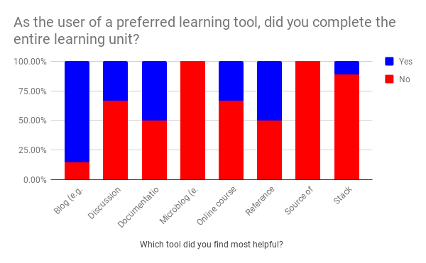
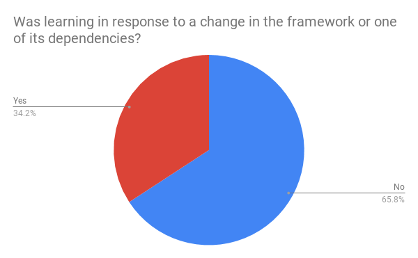
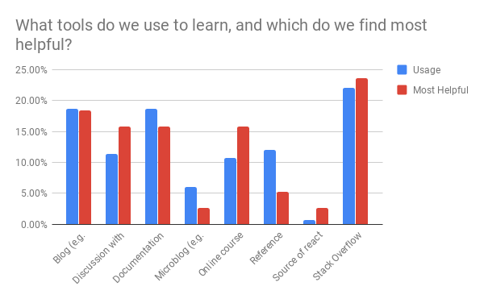
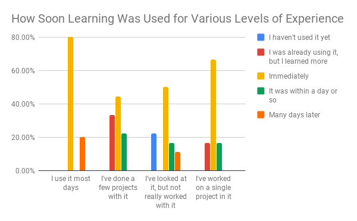

# Background

> For creators of technology, educating users is often a challenge. Some creators tend to introduce formal courses, while some others rely on users referencing documentation and trial-and-error. In some, third parties have created learning materials like weblog tutorials or even reference examples. 
> 
> When considering the traits of technologies, a pattern appears to emerge: those that are rapidly-changing like augmented reality and artificial intelligence seem to depend on informal education. For these, often documentation and a sample are all the materials provided. Looking at more established topics like desktop computing and service management, the case is quite different. Corresponding certifications exist like CompTIA A+ and ITIL Foundation with accompanying curriculum and a network of professional teachers. The options vary greatly as the technology's maturity level changes.
> 
> **How do developers learn rapidly-changing frameworks?**

[@projectproposal]

# Work Status

Consistent with the published [project plan](http://turnrye.com/learning-rapidly-changing-frameworks/project-plan/index.html), this project is on schedule. The questionnaire survey has completed distribution, and some preliminary results have been compiled. The raw survey responses have been uploaded to [the repository](http://turnrye.com/learning-rapidly-changing-frameworks/survey-responses.csv). The next step is to complete the interview surveys.

# Interview Survey

The interview survey asks questions about specific scenarios in which learning occurs. Less focus is given on what tools are used, but more focus is given on the antecedents and consequences of the learning. It will take place over Google Hangouts. Standard interview procedures will be followed [@interviews]. Care is taken to ensure respondents don't need to consult records. This research method will permit judging the quality of response, unlike the questionnaire survey. Additionally, open-ended questions are used to help introduce additional data. The script for this interview is located below.

## Respondents

My goal is to interview 8 individuals using the script below. There were 18 respondents who indicated they were open to participating in a survey, however 2 of which did not provide real e-mail addresses. Of the 16 remaining, 3 are peers of the author. Those 3 will be the first individuals interviewed, then 5 additional will be chosen at random from the remaining.

## Survey Script

> The following interview survey questions are to be conducted in a video chat with the participant. Open by introducing yourself and reading the statement below.
>
> This survey is being conducted as part of a class project on educational technology in graduate studies at the Georgia Institute of Technology. We expect that the interview will take approximately 15 minutes. Please note that your responses may be referenced in our work, however there will be no personally identifiable information shared. This work is considered an informal pilot study, and there is no compensation for participation. Your time is appreciated as we investigate how people learn rapidly changing frameworks.
>
> How old are you?
>
> What country do you live?
>
> What kind of work do you do?
>
> Do you have a formal education in software development?
>
> Are you currently studying React Native as part of a course?
>
> How long have you used React Native?
>
> How satisfied are you as a user of the framework?
>
> How did you hear about it?
>
> How did you initially learn React Native?
>
> How soon after learning it did you start using it?
>
> What most often leads to you learning about React Native today?
>
> Most recently, how have you kept up-to-date with it?
>
> What about using a part of the framework that you're unfamiliar with -- how would you learn about it?
>
> How would you make time to learn?
>
> How do you learn about new features?
>
> Do you consider learning React Native to be routine or instead a special activity?
>
> Thank you participating in our study. We will share the results of your interview within the next two weeks, and we expect to share the study conclusions within a few months.

# Preliminary Survey Results

From the diagrams above, there are three conclusions that I draw: blog articles have the highest completion rate, online courses and peer discussion are the most helpful learning tools, even in a rapidly changing framework most of the learning is for reasons besides change, and learnings most often are immediately put to use.

Based off of my personal anecdote, most blog articles in this community are estimated to take somewhere between 5 and 20 minutes long to read. One of the potential benefits is that one topic can be taught using multiple pedagogies like project and problem based learning. Additionally, the format lends itself to discovering it both just-in-time for use (to help solve a problem) as well as for potential future use (by subscribing to a website). I suspect that these factors may contribute to why blog articles are successful in being completed.

Poor performers included the source code, stack overflow, and microblogs. I suspect that the wording of the question may have lead to users reporting incomplete consumption; it is unreasonable to expect a learner to analyze the entire codebase or an entire stack overflow community.

Online courses and peer discussion were disproportionately selected as the most helpful versus what was used. Poor performers included microblogs and referencing the codebase. Stack overflow showed to be the most frequently helpful tool, but this is consistent with it also being the most frequently used.

Interesting as well, this survey found that nearly 2/3 of learners reported that their learning took place for reasons other than change. I'm interested to consider how the responses change as users report varying levels of experience (daily users vs first time users); this analysis is still yet to be completed.

Finally, regardless of whether you're a framework user daily or have just researched it, the material you learn is immediately put to use. Over half of the responses were this way.

Regression analysis will be performed this week to consider how prior formal education or specific tools may cause different learning outcomes.

# Next Steps

My next steps include performing the interviews and finishing the analysis of the survey data. Once both of those are complete, I will begin preparing my final materials.

# References