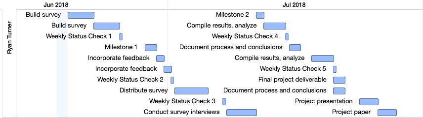

This project will conduct research on how people learn about software development. Specifically, how people who identify as developers (with some previous level of training or experience) go about learning dynamic and growing topics. This proposal will describe the research problem and its concerns, discuss the key deliverables of the work, and provide a coded work breakdown structure with a calendar.

# Research Problem

For creators of technology, educating users is often a challenge. Some creators tend to introduce formal certification courses, while some others rely on users referencing documentation and trial and error. In some, third parties have created learning materials like weblog tutorials or even reference examples. When considering the topic area, a pattern appears to emerge: those that are rapidly-changing like augmented reality and artificial intelligence seem to depend on informal education. For these, often documentation and a sample are all the materials provided. Looking at more established topics like desktop computing and service management, the case is quite different. Certifications like CompTIA A+ and ITIL Foundation have accompanying curriculum and a network of professional teachers. The options vary greatly across all of technology.

Rapidly-changing topics seem to be learned in fragmented, difficult to measure ways. This research will focus on the following problem:

**How do developers learn rapidly-changing frameworks?**

To answer this question, the "where, when, and why" are considered. Specifically, the three following research questions will be investigated:

**RQ1: What learning tools are preferred?**

Understanding what tools are preferred helps to show what traits developers prefer in their tools, as well as what content creators choose to use for teaching. In pursuing this, various tools for learning will be considered. Some examples include institution-sponsored courses, massive open online courses (MOOCs), books, weblog tutorials, forum and knowledge market threads, workshops, and even hackathons. This can answer what structures best suit rapidly-changing frameworks. This detail represents where the learning occurs.

**RQ2: Is their learning motivated by a pressing need?**

When working with rapidly changing frameworks, developers may choose to learn "just-in-time" to solve a problem so as to avoid volatility. Other developers may instead respond to rapid change by closely following progress, proactively learning new materials. These two lend themselves to different kinds of content: the former needs to be problem based and easily found, whereas the latter needs to be more engaging and use constructionism. This detail represents when the learning occurs.

**RQ3: What scope of knowledge do developers pursue?**

The scope of learning tools widely varies, from weeks-long MOOCs to ten-minute read weblog posts. Learning the scope that developers pursue for their learning, whether it's full courses, individual lectures, or even just individual code snippets answers "why" they are learning: is it to move on with their day, or maybe is it to better understand something they already practice?

## Background literature

In this research, non-institutional learning methods will be considered. A specific kind of this is informal learning [@marsick2001informal], which is learning with little structure and often the byproduct of some other activity [@marsick2001informal]. Informal learning is "relevant to practice in many cultures and contexts" and takes "place wherever people have need, motivation, and opportunity for learning" [@marsick2001informal]. While this method is often looked at from a business context [@marsick2001informal; @noe2014learning], motivation could come as uncertainty of creating a new solution or resolving a bug in code. A social component is also defining for informal learning: while the trigger may be considered locally to an individual, it is often the result of an external change such as results of a tester's work or a request from a product owner. Informal learning takes place around all of us day to day.

In looking at how developers learn rapidly-changing frameworks, we must start by reviewing their options. Developers have many solutions available for learning (see [Research Problem](#research-problem)). The next paragraphs describe the informal learning activities that take place within a subset of these.

In research of programmers use of tools, @murphy2011peer shows how peer interaction help leads to more discovery. While discovery is more specifically called "the first stage of some kinds of learning," it does pose a potential type of learning for our problem. Murphy-Hill contrasts peer interaction from Marsick's definition of informal learning, however when consider according to the definition proposed above, the distinctions are removed. In this work, Murphy-Hill demonstrates how situations like happenstance interaction, pair programming, and even change notification often result in peer observations and recommendations. These represent the "discoveries" of tools, but in some cases they also represent the teaching material itself: with pair programming, the peer interaction often creates an incidental situated learning experience.

Hackathons are also proposed as "excellent informal learning platforms" [@nandi2016hackathons]. A hackathon is "face-paced event where competitors work in teams to go from an idea to working software or hardware within a single day or a weekend." Like in @murphy2011peer's work, the authors cite peer-learning as common place in this setting. Consistent with the definition of informal learning, at hackathons the problems create the need, the gamification create the motivation, and the industry mentors plus online resources create the opportunity. While this primarily focused on learnings within teams, they also recognize that the learning environment created at a hackathon excels at producing industry-relevant learnings and skills. WMany kinds of learning may occur within a hackathon, but the overall activity itself is stated as "a great opportunity to learn" [@nandi2016hackathons], and to some considered a tool for learning.

MOOCs present as popular online digital learning tools today, with popular examples being Coursera, edX, and Udacity [@yousef2014review]. When considering learning theories within MOOCs, there tend to be either connectivism-driven MOOCs (cMOOCs) or extension MOOCs (xMOOCs) [@yousef2014review]. The two of these are significantly different in their application of learning models, and more needs to be done to make use of informal, personalized, or professional learning on these platforms [@yousef2014review]. 

The proposed research touches on much of the same idea as one proposed by @noe2014learning: "What antecedents and conditions facilitate continuous learning, especially informal learning, and knowledge sharing?" In considering the form of learning, @noe2014learning mentions that "informal learning may be equally important to or even more important than other forms of learning." In fact, informal learning is so prevalent in organizations that it may account for up to 75% of learning [@noe2014learning; @bear2008tapping]. Yet, the future issue is still proposed: "What are the antecedents and consequences of informal learning?" [noe2014learning].

In the problem itself, the term "frameworks" is used. For the sake of this research, a framework is defined as "a form of software reuse that primarily promotes the reuse of entire architectures within a narrowly defined application domain" [@pasetti2002software].

## Research methodology

A survey research methodology will be used for this work. In order to help control internal validity, the question was constrained to only researching the learning of frameworks.

Dependent variables for this research will include:

- Tools selected
- Time in which learning occurs
- Duration for the learning

Independent variables for this research will include:

- Prior knowledge and experience (both in the framework and in computer science generally)
- Learning style preference
- Access to learning tools

The dependent variables directly map to the research questions proposed; the independent variables will be recorded and included in the analysis.

In order to control for internal validity, the population surveyed will be limited to members of the React Native community. This is picked simply as a matter of convenience for the author, however it ensures that all subjects are learning the same framework. Additionally, subjects will be asked to limit their recollection to only recent times (some number of months) so as to avoid bad reporting; this problem is anticipated based on findings from @murphy2011peer.

In order to control for external validity, it's important to determine what rapidly-changing means and show where this research may be applied. The author does not intend for this research to be inferred as applicable to mature frameworks, or even outside of software frameworks. Additionally, work must be done to establish the characteristics of the React Native framework and its community.

The data needed is responses to the surveys. Should they not be available, either the scope of the study will be reduced, or the surveys will be re-distributed with incentives and more prominent sponsors (community leaders, educators, etc).

# Key Deliverables

There will be five weeks of status reports provided; each will present the process made, and challenges encountered, and an updated project plan. This will show quickly and clearly if the project is on schedule, as well as help determine if the project proposal is still being adhered to.

There will be two intermediate milestones, both largely focusing on the surveys. In the first milestone, both surveys will be presented. This will allow for any last-minute modifications. In the second milestone, the results and analysis from one of the surveys will be presented.

The final project will be a public repository with the structured results from the surveys. It will be posted to Github in an easily consumed, OSS format, such as markdown documentation and csv results. This repository already exists today with source for all assignments, the project plan, and an export of the plan with progress noted. It can be found [here](http://turnrye.com/cs6460-turnrye/).

The final paper will present the findings with a format largely following this document's. The presentation will be a recorded screen session from the author's workplace at one of their biweekly research and training sessions.

# Work Breakdown Structure

The following tasks will take place during the life of this project:

1. Weekly Status Checks
    1. Weekly Status Check 1
    2. Weekly Status Check 2
    3. Weekly Status Check 3
    4. Weekly Status Check 4
    5. Weekly Status Check 5
2. Intermediate Milestones
    1. Milestone 1
    2. Milestone 2
3. Final Deliverables
    1. Project paper
    2. Final project deliverable
    3. Project presentation
4. Broad Developer Survey
    1. Build survey
    2. Incorporate feedback
    3. Distribute survey
    4. Compile results, analyze
    5. Document process and conclusions
5. Detailed Developer Survey
    1. Build survey
    2. Incorporate feedback
    3. Conduct survey interviews
    4. Compile results, analyze
    5. Document process and conclusions

For more details of these tasks, like the duration, constraints, and scheduled times, please refer to the project export in the repository linked above.

# Calendar

In the figure, a snapshot is displayed. Weekly status checks are labeled, and work completed prior to the status check is expected to be presented for that week. The same data is repeated below in a list fashion, with the tasks listed referencing their WBS code from the previous section. Tasks that are listed are expected to be complete and have an update present in that week's status check.

## Week 1

- 4.1 Build survey
- 5.1 Build survey

## Week 2

- 2.1 Milestone 1
- 4.2 Incorporate feedback
- 5.2 Incorporate feedback

## Week 3

- 4.3 Distribute survey

## Week 4

- 5.3 Conduct survey interviews
- 2.2 Milestone 2
- 5.4 Compile results, analyze

## Week 5

- 5.5 Document process and conclusions
- 4.4 Compile results, analyze

## Week 6

- 3.2 Final project deliverable
- 4.5 Document process and conclusions
- 3.3 Project presentation
- 3.1 Project paper

# References