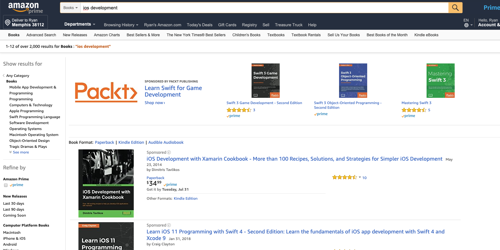
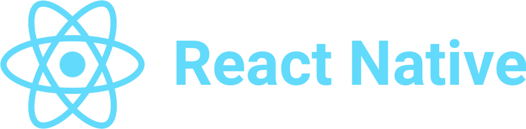
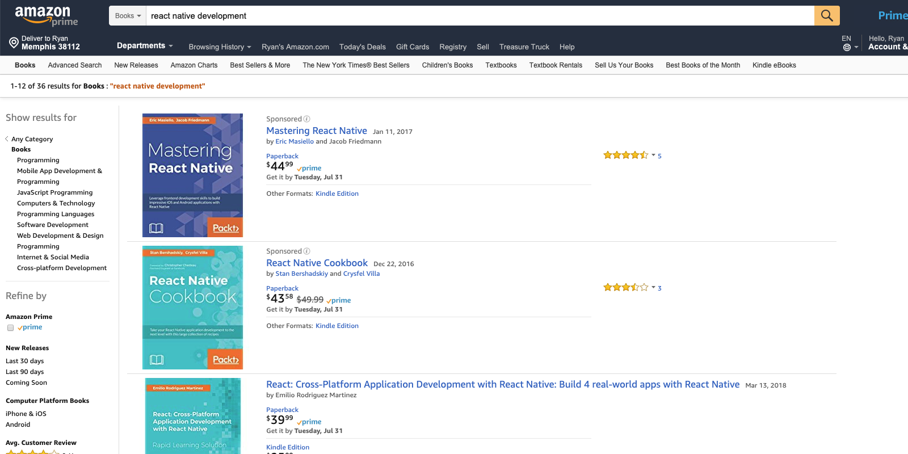
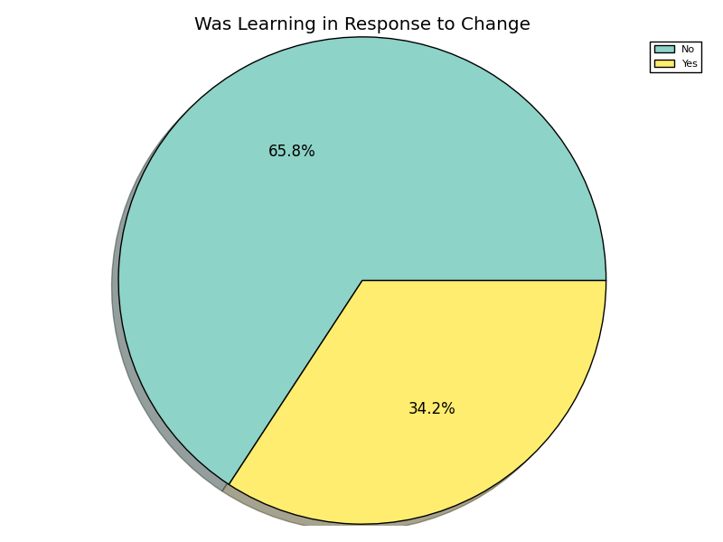
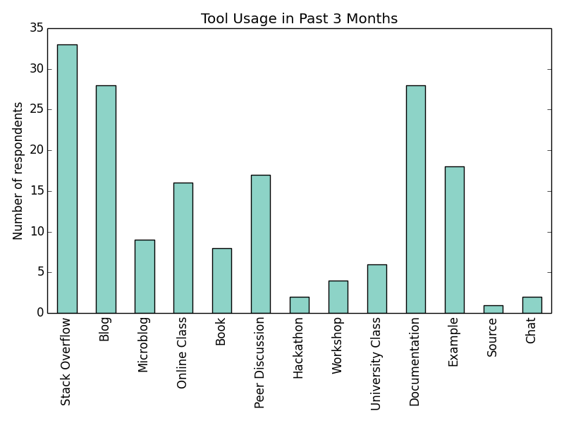
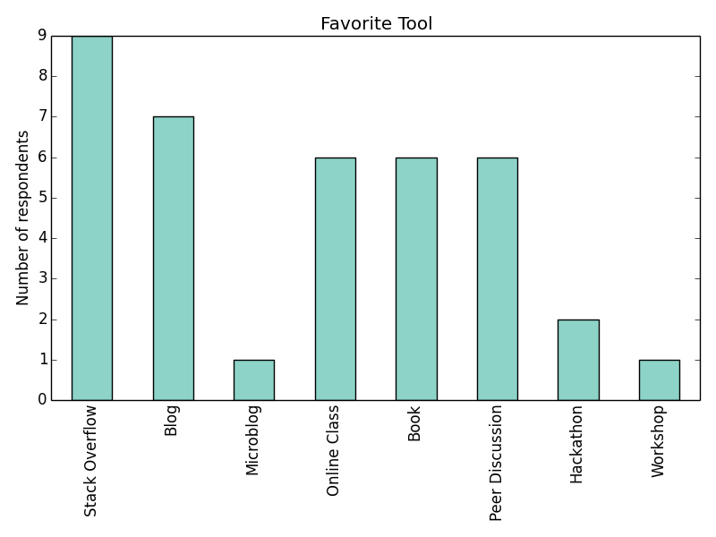
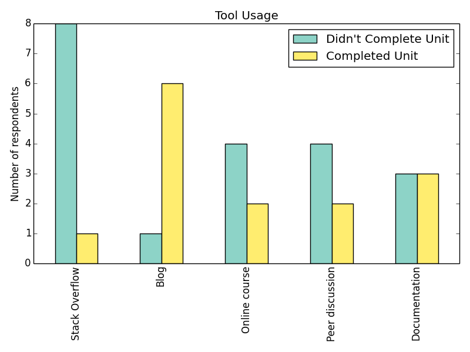

# > 2,000 books

# Cutting edge

# New approaches

# < 100 books

# Just-in-time learning

- Informal
- Short duration
- Heavy discovery
- Immediate application

# Is it from change?

# So where do we go?

- Stack overflow
- Documentation
- Blogs
- Peers
- ... looking for an answer

# 

# What do we like?

*Not* documentation or sample projects

#

# But is it all actually read?

- No!
- ... unless you're reading a blog

#

# What's different with blogs?

- Structured
- Illustrative
- Easy to find, focused
- Can be consumed in 5-10 minutes

# When do learners apply it?

- Immediately!
- They were already!

# But how well does it work?

- ⭐⭐⭐⭐
- 3.8/5.0

# So how do we learn?

- Along the way with what we're doing
- Using lots of resources
- Immediately put it to use
- Stopping when we find the answer

# How do we improve

- Make material easier to find
- Keep it short and consumable
- Continue to build Stack Overflow
- Go beyond a changelog with breaking changes

# Thank you

- http://turnrye.com
- @turnrye
